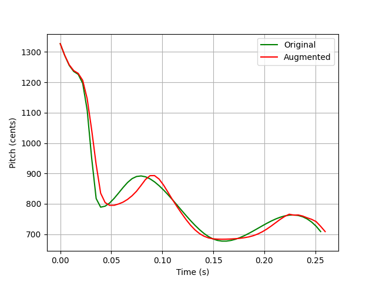
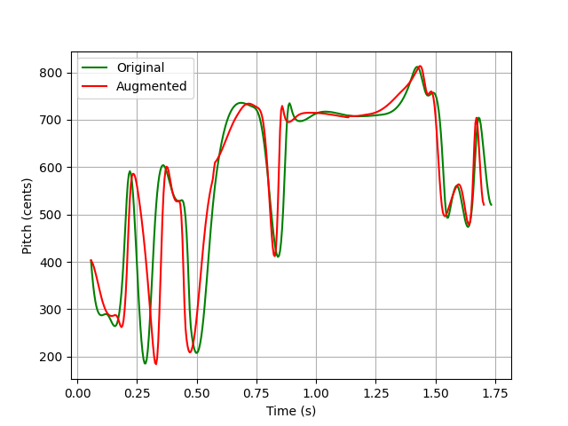
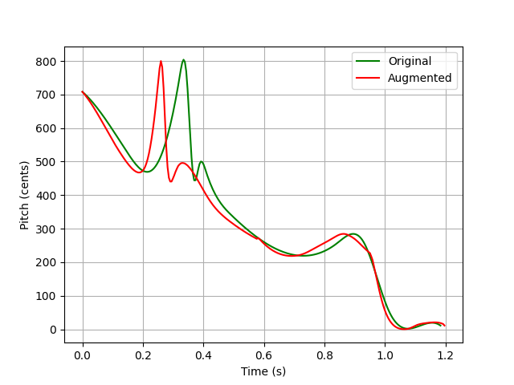

# Svara Time Series Augmentation
Modules for augmenting svara time series by replicating human singing errors without deviating from the svara's ideal form.

# Examples




## How to run

Install dependencies:

```bash
pip install -r requirements.txt
```

Run the script:
```bash
python main.py
```
